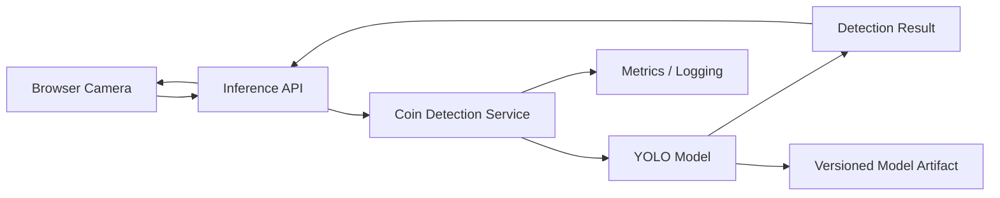

# Thai Coin Detection

Real-time Thai coin detection web application built with YOLOv5, PyTorch, OpenCV, and Flask.

Repository: `kktpx/Coin-Detection`

---

## Overview

Thai Coin Detection is an educational AI / Computer Vision project that detects Thai coins from a webcam stream, classifies coin denominations, draws detection boxes, counts detected coins, and calculates the total monetary value in real time.

The project combines a trained YOLOv5 object-detection model with a Flask web application. OpenCV captures webcam frames, PyTorch performs inference, and Flask streams annotated JPEG frames to the browser.

Supported model classes are intended to represent:

- 10 Baht
- 5 Baht
- 2 Baht
- 1 Baht
- 0.50 Baht

---

## Features

- Real-time webcam capture
- YOLOv5 object detection
- Thai coin denomination classification
- Bounding-box visualization
- Per-class coin counting
- Automatic total-value calculation
- Confidence thresholding
- Non-Maximum Suppression
- FPS display
- Flask browser interface
- MJPEG video streaming
- Dataset directory for YOLO labels/images
- Dataset augmentation utility
- Included YOLOv5 source tree
- Custom trained model weight support

---

## Tech Stack

### Machine Learning

- Python
- PyTorch
- TorchVision
- YOLOv5
- NumPy
- SciPy
- scikit-learn

### Computer Vision

- OpenCV
- Pillow

### Web

- Flask
- HTML
- CSS

### Data / Analysis

- Pandas
- Matplotlib
- Seaborn
- PyYAML
- tqdm

### Model Export Dependencies

The requirements file also includes:

- ONNX
- Core ML Tools

---

## Architecture

```mermaid
flowchart LR
    Camera[Webcam] --> Capture[OpenCV VideoCapture]
    Capture --> Frame[Raw Frame]

    Frame --> Prep[Letterbox + RGB + Tensor + Normalize]
    Prep --> Model[YOLOv5 Model]
    Model --> NMS[Non-Maximum Suppression]

    NMS --> Boxes[Scale Bounding Boxes]
    Boxes --> Count[Count Coin Classes]
    Count --> Total[Calculate Total Baht]
    Total --> Overlay[Draw Boxes / Labels / FPS]

    Overlay --> JPEG[Encode JPEG]
    JPEG --> Stream[Flask /video_feed]
    Stream --> Browser[Web Browser]
```



---

## Runtime Data Flow

1. `VideoCamera` opens camera index `0`.
2. A frame is read through OpenCV.
3. `main_process()` copies and preprocesses the frame.
4. The frame is resized using YOLOv5 `letterbox()`.
5. Image data is converted into a PyTorch tensor.
6. Pixel values are normalized to `0-1`.
7. YOLOv5 performs object detection.
8. `non_max_suppression()` filters overlapping/low-confidence predictions.
9. Bounding boxes are scaled back to the original image.
10. Each predicted coin class is counted.
11. The class name is converted to a numeric Baht value.
12. The total coin value is calculated.
13. Detection labels, counts, total value, and FPS are rendered on the frame.
14. The frame is JPEG-encoded.
15. Flask streams it to the browser as an MJPEG response.

---

## Current Model Configuration

The current application configuration in `app.py` uses:

```python
imgsz = 640
my_confidence = 0.80
my_threshold = 0.45
```

The model weight path is:

```text
yolov5/weights/coin_v1-9_last.pt
```

The application automatically selects an available PyTorch device and uses half precision when running on a non-CPU device.

---

## Project Structure

```text
Coin-Detection/
├── app.py
├── augment_dataset.py
├── requirements.txt
├── README.md
├── LICENSE
├── coin_dataset/
│   ├── classes.txt
│   ├── coin_dataset.yml
│   ├── images/
│   └── labels/
├── docs/
├── labelImg-master/
├── screenshot/
├── templates/
├── trained/
└── yolov5/
    └── weights/
        └── coin_v1-9_last.pt
```

### Important Files

| Path | Purpose |
|---|---|
| `app.py` | Flask application and real-time inference pipeline |
| `augment_dataset.py` | Dataset augmentation utility |
| `coin_dataset/` | Coin dataset and YOLO annotations |
| `coin_dataset/coin_dataset.yml` | YOLO dataset configuration |
| `coin_dataset/classes.txt` | Class list |
| `templates/` | Flask HTML templates |
| `yolov5/` | YOLOv5 implementation used by the app |
| `yolov5/weights/coin_v1-9_last.pt` | Current custom model weight |
| `requirements.txt` | Python dependencies |

---

## Prerequisites

Recommended local requirements:

- Python
- pip
- Git
- Webcam
- Enough memory to load PyTorch and YOLOv5
- Optional CUDA-compatible GPU for faster inference

Check:

```bash
python --version
pip --version
git --version
```

---

## Installation

### 1. Clone

```bash
git clone https://github.com/kktpx/Coin-Detection.git
cd Coin-Detection
```

### 2. Create a virtual environment

macOS / Linux:

```bash
python -m venv .venv
source .venv/bin/activate
```

Windows PowerShell:

```powershell
python -m venv .venv
.venv\Scripts\Activate.ps1
```

### 3. Install dependencies

```bash
python -m pip install --upgrade pip
pip install -r requirements.txt
```

Because this repository includes a YOLOv5 codebase and broad dependency ranges, dependency compatibility can vary between Python/PyTorch versions. For a reproducible environment, consider pinning exact versions after confirming a working setup.

### 4. Verify the trained model exists

Confirm:

```text
yolov5/weights/coin_v1-9_last.pt
```

If the weight is missing, the application will not be able to load the model.

### 5. Connect a webcam

The application currently opens:

```python
cv2.VideoCapture(0)
```

`0` normally means the default webcam.

If another camera should be used, change the camera index in `VideoCamera`.

### 6. Run

```bash
python app.py
```

The Flask app runs on:

```text
http://127.0.0.1:5000
```

It binds to `0.0.0.0`, so it may also be reachable from other devices on the same network when local firewall settings allow it.

---

## Web Routes

| Route | Method | Description |
|---|---|---|
| `/` | GET | Render the main web interface |
| `/video_feed` | GET | Stream processed camera frames as MJPEG |

---

## Detection Pipeline

The main inference function is:

```text
main_process(input_img)
```

Conceptually:

```text
Input frame
   ↓
Resize / letterbox
   ↓
BGR → RGB
   ↓
HWC → CHW
   ↓
NumPy → PyTorch
   ↓
Normalize
   ↓
YOLOv5 inference
   ↓
NMS
   ↓
Scale bounding boxes
   ↓
Count classes
   ↓
Calculate Baht
   ↓
Draw annotations
   ↓
Processed frame
```

---

## Dataset Structure

The dataset follows the common YOLO image/label layout.

```text
coin_dataset/
├── classes.txt
├── coin_dataset.yml
├── images/
└── labels/
```

Each image should have a corresponding YOLO annotation text file when it is used as labeled training data.

A YOLO label line typically follows:

```text
<class_id> <x_center> <y_center> <width> <height>
```

Coordinates are normalized relative to image width and height.

---

## Data Augmentation

`augment_dataset.py` is included to increase dataset variety.

When extending augmentation, keep transformations realistic for the actual use case. Useful transformations for coin detection can include:

- Small rotations
- Moderate brightness changes
- Contrast variation
- Small scale variation
- Mild blur
- Different background conditions

Avoid transformations that make the coin geometry unrealistic or destroy denomination details.

---

## Training / Retraining

The repository includes YOLOv5 and a dataset configuration, so retraining can be performed from the included YOLOv5 project when the dataset and environment are prepared.

Before training:

1. Verify train/validation image paths
2. Verify label paths
3. Verify class order
4. Verify `coin_dataset.yml`
5. Check annotation quality
6. Separate validation data from training data
7. Record the exact training configuration

After training, place the selected weight file where the application expects it or update `my_weight` in `app.py`.

---

## Model Evaluation

A production-quality README should document model performance, not only screenshots.

Recommended metrics:

- Precision
- Recall
- mAP@0.5
- mAP@0.5:0.95
- Per-class AP
- Confusion matrix
- Inference latency
- FPS on CPU
- FPS on GPU

Also test challenging real-world cases:

- Low light
- Strong reflections
- Multiple overlapping coins
- Different backgrounds
- Partial occlusion
- Far/near camera distance
- Mixed denominations

---

## Configuration

Current runtime constants are located in `app.py`.

```python
imgsz = 640
my_confidence = 0.80
my_threshold = 0.45
```

Recommended future improvement: move these values into configuration or environment variables, for example:

```env
CAMERA_INDEX=0
MODEL_PATH=yolov5/weights/coin_v1-9_last.pt
IMAGE_SIZE=640
CONFIDENCE_THRESHOLD=0.80
IOU_THRESHOLD=0.45
```

This environment-variable example is a recommended refactor; the current code does not read these variables automatically.

---

## Troubleshooting

### Camera not found

The current application displays a blank frame with `Camera not found` if OpenCV cannot read the webcam.

Check:

- Another application is not using the camera
- Browser / OS camera permissions
- Correct OpenCV camera index
- USB camera connection

Try another index in code:

```python
cv2.VideoCapture(1)
```

### Model file not found

Verify:

```text
yolov5/weights/coin_v1-9_last.pt
```

### Import error from YOLOv5

The application adds the local `yolov5` directory to Python's import path. If YOLO imports fail:

- Confirm the `yolov5/` directory is complete
- Install all project requirements
- Check PyTorch / TorchVision compatibility
- Use a clean virtual environment

### Very low FPS

Possible improvements:

- Run on a supported GPU
- Reduce `imgsz`
- Disable costly augmentation at inference if acceptable
- Avoid unnecessary frame copies
- Process fewer frames
- Use an exported/optimized inference format when appropriate

---

## Security / Deployment Notes

This application accesses a physical webcam from the Python process. A typical cloud server does not have access to the user's local browser webcam in the same way as a local OpenCV process.

For a real remote deployment, consider changing the architecture to:

```text
Browser getUserMedia()
        ↓
Upload frame / WebRTC
        ↓
Inference API
        ↓
Prediction JSON / annotated image
```

The current architecture is best suited to local or edge-device execution where the Flask process can access the camera directly.

---

## Recommended Tests

### Unit Tests

Test:

- Class-to-Baht conversion
- Total-value calculation
- Empty detection handling
- JPEG encoding
- Model path validation

### Integration Tests

Test:

- `/` returns successfully
- `/video_feed` returns an MJPEG response
- Camera failure does not crash the server
- Model load failure produces a clear startup error

### Model Tests

Maintain a fixed evaluation set and verify model metrics do not regress after retraining.

---

## Recommended Improvements

### Code Quality

- Extract model loading into a dedicated module
- Extract inference logic from Flask routes
- Add a configuration class
- Add logging instead of `print`
- Add structured error handling
- Add tests
- Pin dependency versions

### ML / MLOps

- Store training configuration
- Record model metrics
- Version model weights
- Add dataset documentation
- Add dataset/source license information
- Keep a model card
- Add reproducible training commands

### Web Application

- Camera selection control
- Adjustable confidence threshold
- Start/stop camera controls
- Responsive detection statistics
- Detection history
- Screenshot capture
- Better error UI

---

## Suggested Future Architecture



This separates browser capture, API responsibilities, inference, and model lifecycle management.

---

## Contributing

1. Fork the repository
2. Create a new branch
3. Keep model/code changes focused
4. Test locally
5. Document model changes
6. Open a pull request

---

## License

This project includes an MIT License. See `LICENSE` for full terms.
